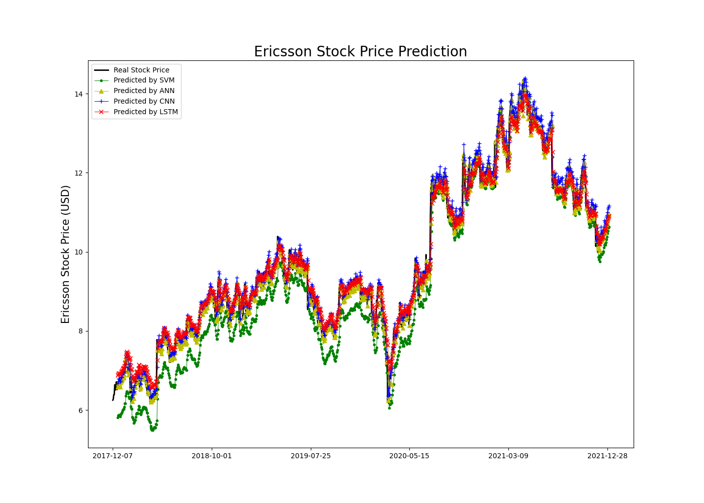

# Stock Share Price Prediction
The purpose of this project is to demonstrate the stock prediction with Deep Learning techniques.

The stock prices are time-series data on a discrete time scale which is a sequence of observations taken sequentially in time.

In this project, the data should be provided in a CSV file format as Yahoo Finance provides.


## Algorithms
The main algorithms here for Deep Learning are Convolutional Neural Network (CNN) algorithm and Long Short-Term Memory (LSTM) algorithm.

Also, Support Vector Machine (SVM) algorithm and Artificial Neural Network (ANN) algorithm are tested for comparison.


## Examples
Here, I used Ericsson's stock share price datasets. 

* Ericsson stock price for the last 5 years
    * https://finance.yahoo.com/quote/ERIC/history?period1=1483315200&period2=1641081600&interval=1d&filter=history&frequency=1d&includeAdjustedClose=true


```
# Evaluation for the Last 5 Years Dataset
RMSE SVM: 0.23000383566227575
MAPE SVM: 6.732032407375285 (%)
--
RMSE ANN: 0.2324005828234199
MAPE ANN: 1.5341399255966959 (%)
--
RMSE CNN: 0.2848475130897551
MAPE CNN: 1.7226078507772442 (%)
--
RMSE LSTM: 0.35558621202394486
MAPE LSTM: 2.38913470426218 (%)
```

* Ericsson stock price for the maximum available period
    * https://finance.yahoo.com/quote/ERIC/history?period1=367459200&period2=1641081600&interval=1d&filter=history&frequency=1d&includeAdjustedClose=true
    


```
# Evaluation for Maximum Period Dataset
RMSE SVM: 0.5447417628108924
MAPE SVM: 25.10982959398172 (%)
--
RMSE ANN: 0.21356547909520707
MAPE ANN: 1.4998535472906032 (%)
--
RMSE CNN: 0.27107912005564205
MAPE CNN: 2.178262393926834 (%)
--
RMSE CNN: 0.27107912005564205
MAPE CNN: 2.178262393926834 (%)
```


## References
* https://towardsdatascience.com/lstm-time-series-forecasting-predicting-stock-prices-using-an-lstm-model-6223e9644a2f
